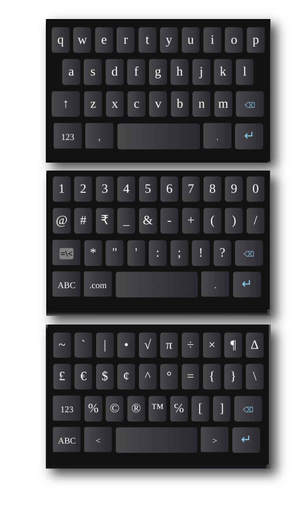

# Virtual Keyboard with html, css, js(jquery)
[Live test here](https://kamla.com.np/app/vkb/)



## Steps to implement in your website
### Step 1
First of all, you have to use two script tags one for keyboard another for jquery.
```
<script src="https://code.jquery.com/jquery-3.5.1.js" 
integrity="sha256-QWo7LDvxbWT2tbbQ97B53yJnYU3WhH/C8ycbRAkjPDc=" 
crossorigin="anonymous"></script>

<script src="https://kamla.com.np/app/vkb/keyboard.js?V=1" onload="keyboard();"></script>

```
### Step 2
You have to add id="an_input" in the `input` or `textarea` tag
```
<textarea 
	id="an_input" 
	onblur="this.focus()" 
	inputmode="none"  
	name="input" 
	rows="12">Type Here
</textarea>

```
### Step 3
Add a div tag with id="keyboard" where you want to add a keyboard.
```
<div id="keyboard"></div>
```
>Thats all you have to do. Now you can test it by running on the browser.

## Full page code
This is the full code of a page.
```
<html>
    <head>
        <title>Keybard</title>
        <script src="https://code.jquery.com/jquery-3.5.1.js" integrity="sha256-QWo7LDvxbWT2tbbQ97B53yJnYU3WhH/C8ycbRAkjPDc=" crossorigin="anonymous"></script>
        <script src="https://kamla.com.np/app/vkb/keyboard.js?V=1" onload="keyboard();"></script>
        <style>
            #an_input{
                margin: 0 auto;
                width: 22em;
                display: block;
                background-color: #eeeeee;
                border: none;
                padding: 1em;
                font-size: 1.2em;
            }
            #help{
                text-align: center;
                margin: 1em auto;
                padding: 0.2em;
                border-radius: 0.2em;
                color: white;
                text-decoration: none;
                display: block;
                width: 13em;
                background:green;
                box-shadow: 2px 2px 2px 2px #aaccaa;
            }
            #help:hover{
                box-shadow: 1px 1px 1px 1px #aaccaa;
            }
        </style>
    </head>
    <body>
        <a id="help" href="https://kamla.com.np/?post=vkbimplementation">See Implementation method</a>
        <textarea id="an_input" onblur="this.focus()" inputmode="none"  name="unicodebox" rows="12" cols="50">Type Here</textarea>
        <div id="keyboard"></div>
    </body>
</html>
```